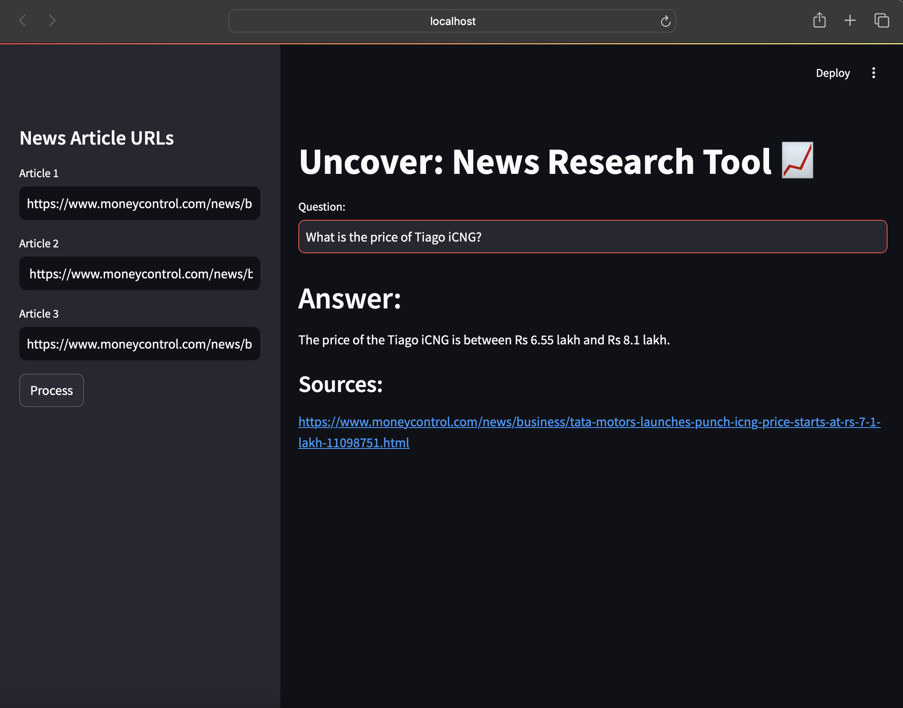
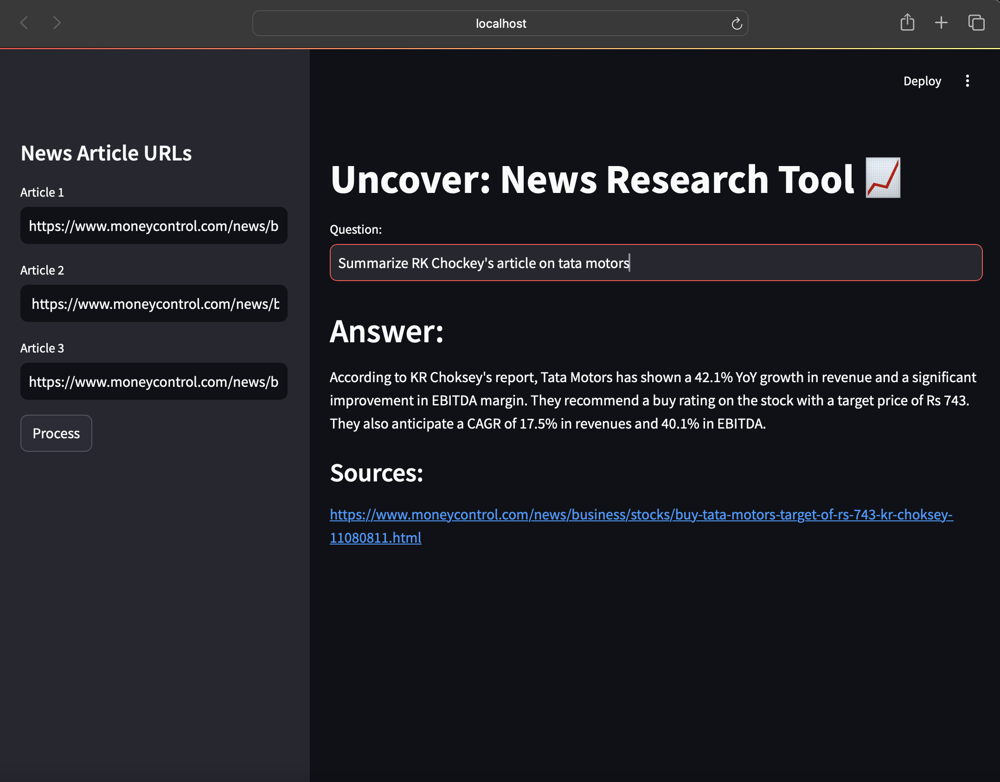

# Uncover: A Research Tool 📈

## Overview
Uncover is a **research tool** that leverages **LangChain** and **OpenAI** to extract, embed, and query information from online  articles. By processing URLs, it creates a searchable vector store for question answering, making it easier to uncover insights and sources from multiple articles.

## Features
- Input up to three news article URLs for analysis.
- Text extraction and splitting for structured data processing.
- Vector store creation using **FAISS** and **OpenAI embeddings**.
- Question-answering with retrieval of relevant information from processed articles.
- Displays sources of the retrieved answers for transparency.

## Requirements
- Python 3.10
- Streamlit
- LangChain
- FAISS
- OpenAI Python API
- dotenv

## Installation
1. Clone the repository:
   ```bash
   git clone Sarthak2403/GenAI-Uncover-A-Research-Tool
   ```

2. Navigate to the project directory:
   ```bash
   cd uncover-news-research
   ```

3. Install dependencies:
   ```bash
   pip install -r requirements.txt
   ```

4. Add your OpenAI API key:
   - Create a `.env` file in the project directory.
   - Add your API key to the file:
     ```
     OPENAI_API_KEY=your_openai_api_key_here
     ```

## How to Use
1. Start the Streamlit app:
   ```bash
   streamlit run main.py
   ```

2. Enter up to three articles URLs in the sidebar.

3. Click the **Process** button to load, split, and embed the articles.

4. Once processing is complete, enter your query in the **Question** input field.

5. View the answer and sources directly on the app.

## Workflow
### 1. URL Processing
- Users provide up to three URLs in the sidebar.
- The tool uses **UnstructuredURLLoader** to extract content from the URLs.

### 2. Text Splitting
- The text is split into manageable chunks using **RecursiveCharacterTextSplitter** for better processing.

### 3. Embedding and Vector Store Creation
- The content is embedded using **OpenAIEmbeddings** and stored in a **FAISS** vector store.
- The vector store is saved locally for reuse.

### 4. Question Answering
- Queries are processed using **RetrievalQAWithSourcesChain**.
- Answers and their sources are displayed in the Streamlit interface.

## File Details
- `main.py`: Main Streamlit application script.
- `requirements.txt`: Lists all required dependencies.
- `.env`: Stores the OpenAI API key.

## Enhancements
- Add support for more URLs and advanced query options.
- Optimize embeddings and storage for faster processing.
- Include additional data visualization features for query results.

## Acknowledgments
- Built using [LangChain](https://langchain.readthedocs.io/).
- Powered by [OpenAI](https://openai.com/).

## Outputs



